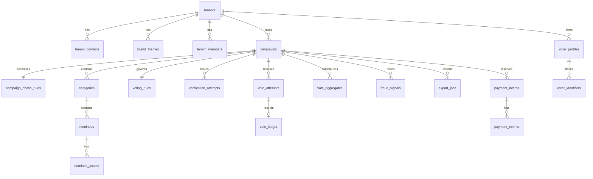

# ERD

## Notes

- `vote_ledger` is the source of truth for accepted votes.
- `vote_aggregates` is a read model for leaderboards/results.
- `payment_intents` and `payment_events` are reserved now for future paid/hybrid voting.
